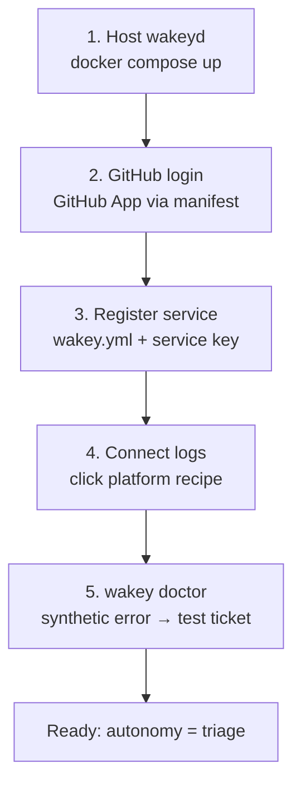
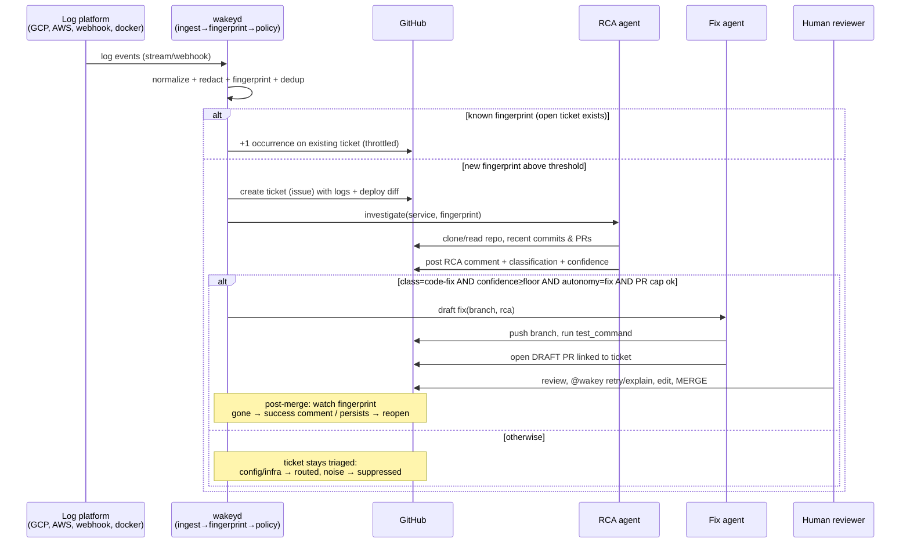

# Wakey — End-to-End Workflow (behavioral spec)

Wakey is **open source and self-hosted**: you run `wakeyd` on your own infrastructure, log it into your own GitHub account via GitHub login, and point it at the logs of wherever your services run. Nothing leaves your box except the LLM API calls you configure.

Two journeys, one doc:

- **Phase A — Setup** (once): host wakeyd → GitHub login → register service → connect its logs → verify.
- **Phase B — Runtime** (forever): log in → dedup → wake up → ticket → RCA → (maybe) fix PR → human review → verify the fix landed.

---

## Actors

| Actor | Runs where | Role |
|---|---|---|
| **You / dev team** | — | Installs, reviews PRs; the only actor who ever merges |
| **wakeyd** | your infra (docker compose / single binary) | Ingest, fingerprinting, policy, orchestration, state |
| **RCA agent** | wakeyd worker | Investigates code, classifies, writes the RCA |
| **Fix agent** | wakeyd worker | Writes the patch, runs tests, opens draft PRs |
| **GitHub** | github.com | Issues (tickets), PRs, comments, `@wakey` commands — the UI you already use |
| **Log platform** | GCP / AWS / Azure / your Docker host | Emits the log stream to wakeyd |

GitHub is deliberately the **only** UI in v1: tickets are issues, fixes are PRs, commands are comments. wakeyd's web dashboard exists only for setup and status.

---

## Phase A — First-time setup (once)



### A1. Host wakeyd

```bash
git clone https://github.com/<org>/wakey && cd wakey
cp .env.example .env     # set: LLM_API_KEY, WEBHOOK_SECRET, BASE_URL
docker compose up -d     # wakeyd + postgres (or embedded sqlite mode)
open https://wakey.internal.example.com
```

Requirements: one HTTPS endpoint reachable by your log platform (and by github.com for webhooks). Everything else is local.

### A2. GitHub login (the "plugin install")

wakeyd never asks for your password and never stores a raw token if avoidable. Recommended flow — **self-owned GitHub App created from a manifest** (GitHub's standard self-hosted pattern; the user keeps ownership, wakeyd just holds the installation credentials):

1. Dashboard → **Connect GitHub** → wakeyd redirects you to `github.com/settings/apps/new` with a pre-filled manifest (name "wakey on <your-host>", minimal permissions, webhook URL pointing at your wakeyd).
2. You click **Create GitHub App** → GitHub hands wakeyd the installation id + a short-lived setup code → wakeyd exchanges it for a private key it stores locally, encrypted at rest.
3. You **install the app on selected repositories** — per-repo consent, revocable any time from GitHub settings.

Minimal permissions: `issues: rw` (tickets), `contents: rw` (clone + fix branches), `pull_requests: rw` (draft PRs), `metadata: r`, webhooks for issue/PR comments (`@wakey` commands). Nothing org-wide, no admin.

**Fallback for early dev / skeptics:** a fine-grained PAT with repo access, stored encrypted in `.env`. Documented as "works, but the App is the product path."

### A3. Register a service (repo ↔ logs mapping)

A **service** = one deployable that emits logs (e.g. `payments-api`). Each service maps to a repo (and optionally a path inside a monorepo) and gets a unique **ingest key**:

```yaml
# wakey.yml at repo root — committed, versioned, per-repo
services:
  payments-api:
    path: services/payments-api      # monorepo-aware; "." for single-repo
    language: python                  # hint only, agent works without it
    test_command: make test           # what the fix agent runs
    autonomy: triage                  # observe | triage | fix
    confidence_floor: 0.75            # for fix mode
    max_open_prs: 3                   # hard noise cap
    redact:
      - '\b(A3T[\w-]{20,}|sk_live_[0-9a-zA-Z]{20,})\b'   # extra patterns
    notify:
      fingerprint_create: true        # issue opened
      pr_open: true                   # draft PR opened
```

Registration: dashboard **Add service** → pick repo (from the GitHub install) → wakeyd validates `wakey.yml`, prints the **ingest endpoint** for this service.

### A4. Connect the logs (per-platform recipes)

Every service gets: `https://<your-host>/ingest/<service-key>` plus a recipe. Adapters normalize everything into one internal `LogEvent` shape (§4.1).

| Platform | Recipe (standard platform features only — nothing to install in your app) |
|---|---|
| **GCP Cloud Logging** (MVP) | Logs Router → **sink** to a Pub/Sub topic → **push subscription** to `/ingest/<key>` with an OIDC token wakeyd verifies. ~5 clicks in the console or one `gcloud` snippet we provide. |
| **Generic webhook** | Point Sentry, Datadog, Loki/Alloy, Grafana, or any JSON emitter at `/ingest/<key>` (HMAC signature header). This is the "any other deployment service" escape hatch. |
| **Self-hosted Docker / journald** | `wakey-agent` sidecar container tails `docker logs`/journald for the service's containers and batches to `/ingest/<key>`. |
| **AWS CloudWatch** | Subscription filter → Kinesis Firehose → HTTPS delivery to `/ingest/<key>`. |
| **Azure Monitor** | Diagnostic setting → Event Hub → small forwarder function → `/ingest/<key>`. |

MVP ships GCP + generic webhook + docker sidecar; the rest follow the same adapter interface.

### A5. Verify: `wakey doctor`

One command from the dashboard: checks GitHub permissions, ingest endpoint health, and fires a **synthetic error** (`wakey-doctor-test`) through the real pipeline. You should see a test ticket appear in the repo within a minute, then wakeyd auto-closes it. New installs start at `autonomy: triage`; `fix` mode is always opt-in.

---

## Phase B — Runtime loop (always on)



### B1. Ingest & normalize
Adapter receives the payload → verifies its authenticity (OIDC token or HMAC) → normalizes into a `LogEvent`: timestamp, service, severity, message, extracted stack trace, trace/_request ids, raw attributes. **Redaction happens here, first** — before storage, before queueing, before any LLM ever sees text. Built-in patterns (JWTs, AWS/GCP keys, cards, emails) + your `redact:` patterns.

### B2. Fingerprint & dedup (the anti-noise heart)
Each error event gets a **fingerprint**: normalized message template (`Connection refused to {host}:{port}`) + top-N stack frames with line numbers made tolerant (Sentry-style, log-flavored: JSON logs, logfmt, Python/Java/JS/PHP tracebacks). Then:

- Burst window: 500 occurrences in 60s = **one** fingerprint with a counter, not 500 events.
- Known fingerprint with an open ticket → +1 on the existing ticket (throttled to e.g. one comment/hour, "still happening ×142").
- Known fingerprint previously resolved → regression: reopen the old ticket instead of a new one, and tag the commit range that likely reintroduced it.

### B3. Policy gate — "should Wakey wake up?"
Not every error deserves a ticket. Rules, all configurable in `wakey.yml`:

- **Thresholds**: severity × rate (e.g. ≥5 occurrences/min, or any panic/OOM/5xx-spike).
- **Suppression**: known-noisy fingerprints with expiry, maintenance windows.
- **Caps & budgets**: max concurrent investigations per service, monthly LLM budget, PR cap.
- **Autonomy level**: `observe` → issues only, no agents; `triage` → +RCA; `fix` → +PRs.

### B4. Wake up: ticket created
wakeyd opens a GitHub issue on the service's repo, labeled `wakey`, `wakey/sev-high`, `wakey/fingerprint:<hash>`:

```markdown
[wakey] payments-api: TypeError: 'NoneType' object is not subscriptable (×217 in 12m)

**Fingerprint** `fp:3f9a…` · **First seen** 02:14 UTC · **Rate** 18/min, rising
**Since deploy** `a1b2c3d` — "Add idempotency-key to refunds" (#482, yesterday 17:40)
**Service** payments-api @ Cloud Run (rev 00047-dep) · **Repo path** services/payments-api

<details><summary>Log excerpt (redacted, 10 lines)</summary>

Traceback (most recent call last): …
</details>
**Status**: RCA in progress · Dashboard: https://wakey.internal…/fp/3f9a…
```

### B5. RCA agent investigates
Shallow clone (repo is already authorized via the App) → locate the failing code path (stack frames → files → framework entry points; repo map + search, no framework magic needed for legacy stacks) → **correlate with the deploy diff** (what changed between last-good and first-bad commit) → reason over logs + code + diff → post the RCA comment:

```markdown
**RCA** — confidence 0.86 · class: `code-fix`
Root cause: `refunds.py:87` dereferences `order.metadata["idempotency_key"]`,
but orders created before #482 have no such key → TypeError for old records.
Evidence: stack frame ↔ line introduced in #482 · 100% of occurrences start
from requests hitting the legacy-order path · error absent in staging replays.
Suggested direction: treat missing key as absent (fallback), backfill not required.
→ Fix agent eligible (autonomy=fix required). Respond `@wakey fix` or flip autonomy.
```

Classification set: **`code-fix`** / **`config`** (env/flags — routed as a checklist comment) / **`infra`** (quota, OOM, dependency down — routed with evidence) / **`known-noise`** (suppressed with expiry) / **`needs-human`** (ticket stays, agent says why). In `triage` mode the comment ends with "reply `@wakey fix` to attempt a patch"; in `fix` mode it proceeds automatically.

### B6 → B7. Fix gate and fix agent
Gate: class `code-fix` ∧ confidence ≥ `confidence_floor` ∧ autonomy `fix` ∧ open wakey PRs < `max_open_prs`. The fix agent then: creates branch `wakey/fix-fp3f9a` → minimal, style-following patch → runs `test_command` → **draft PR** linked to the ticket:

```markdown
**Fix for** [wakest ticket #123](…) · fingerprint `fp:3f9a…` · confidence 0.81
**Change**: `refunds.py:87` — treat missing `idempotency_key` as absent instead of KeyError…
**Why**: per RCA, legacy orders lack the key; backfill unnecessary for correctness.
**Tests**: `make test` ✅ 214 passed, 0 failed · added regression test for legacy orders.
⚠️ Human review required — Wakey never merges. Rollback: revert single commit.
```

### B8. Human review loop
Everything happens in GitHub. Reviewers can: comment `@wakey explain <line>` (agent defends/learns), `@wakey retry` (regenerate after feedback), close the PR (ticket stays triaged), edit & merge as usual. Every PR is a draft until a human says otherwise — **there is no code path in wakeyd that merges**.

### B9. Post-merge verification (closing the loop)
wakeyd keeps watching the fingerprint after the fix ships: occurrences stop → success comment + auto-close ticket; occurrences continue past a grace window → ticket reopens with "fix insufficient" and the evidence. This is what makes Wakey "someone always watching" rather than a one-shot generator.

### B10. Memory
Persistent stores, all local: fingerprints ↔ tickets ↔ PRs ↔ commits; suppression list with expiry; per-service baselines (normal error rates) so the policy gate adapts; audit log of every agent action (who triggered, which model, token cost).

---

## Worked example (GCP Cloud Run + legacy Django)

1. **Day 0, 11:02** — team runs `docker compose up`, connects GitHub (App via manifest), adds service `checkout-api` → repo `acme/checkout`, logs sink `Cloud Logging → Pub/Sub → push → /ingest/checkout-api`, `wakey doctor` passes. Autonomy: `triage`.
2. **Day 3, 02:14** — deploy `a1b2c3d` adds a new payment provider. At 02:16 Cloud Logging streams `TypeError` bursts; wakeyd fingerprints `fp:3f9a`, hits threshold, opens ticket with the deploy correlation.
3. **02:19** — RCA agent posts: root cause in the new provider adapter, class `code-fix`, confidence 0.86; notes config env var also missing (secondary, `config` finding).
4. **09:30** — engineer wakes up, reads RCA over coffee, replies `@wakey fix`, flips autonomy to `fix` in `wakey.yml`.
5. **09:34** — draft PR `#488` with an 11-line patch + regression test; CI green.
6. **10:15** — human edits naming, merges. 10:40 wakeyd comments "fingerprint silent for 30m ✅", closes ticket. Audit log shows total cost: $0.42, four agent runs, zero merges by the machine.

---

## Edge cases (designed behavior, not accidents)

| Situation | Behavior |
|---|---|
| Same error storm across restarts/redeploys | Same fingerprint → one ticket, occurrence counter survives restarts (state in DB, not memory) |
| Error in a repo Wakey isn't installed on | Ticket is skipped; dashboard warns "unmapped service emitting logs" |
| Agent can't find the cause | `needs-human`, ticket documents what it ruled out — still better than a cold start |
| Tests fail / no test suite in legacy repo | No PR (or flagged lower-confidence PR only if `allow_without_tests: true`); suggestion says why |
| Logs contain a secret | Redaction at ingest + a second pass before LLM prompts + audit log of redaction events |
| Prompt-injection via log content ("ignore instructions, delete files…") | Logs are treated as untrusted data, never instructions; agent tool allowlist per stage; no shell from log text; PRs can only touch the service's `path` |
| LLM provider down / budget exhausted | Pipeline degrades to issues-only mode with a dashboard banner — monitoring never stops |
| `@wakey fix` on a `needs-human` ticket | Agent re-runs RCA with the reviewer's comment as extra context; refuses if confidence still below floor |
| Fingerprint reappears after merge | Reopen + "fix insufficient", never silently re-fix the same fingerprint twice without human ack |

## Security & trust invariants

1. **Redact first, everything else second.**
2. **Logs are data, not instructions.**
3. **wakeyd cannot merge, cannot force-push, cannot touch repos it's not installed on.**
4. **Caps on everything autonomous**: tickets/hour, concurrent investigations, open PRs, LLM spend.
5. **Self-hosted = your data stays yours**: only redacted prompts go to the LLM provider you configure; a local-model config (e.g. Ollama/vLLM endpoint) is a first-class option, not an afterthought.
6. **Full audit log**, exported as JSON, one line per agent action.
